= 🕺💃
:source-highlighter: highlight.js
:highlightjs-languages: bash, gherkin, javascript, json, scala
:icons: font
:burger-quiz-url: https://github.com/jvauchel/kapoeira-dance/blob/main/burger-quiz

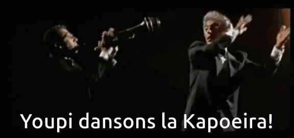

== Presentation

=== Presentation

Mehdi Rebiai::
* icon:github[] https://mrebiai.github.io/[^]
* icon:envelope[] mehdi.rebiai.dev@gmail.com
* Techlead & Data engineer at https://www.lectra.com[Lectra^]

=== Presentation

Johanna Vauchel::
* icon:github[] https://jvauchel.github.io/[^]
* icon:envelope[] vauchel.johanna@gmail.com
* Data engineer at https://www.lectra.com[Lectra^] & speaker 🎤

ifdef::conf-webinar[]
=== Presentation

François Barbe::
* icon:github[] https://github.com/fb33[^]
* icon:envelope[] f.barbe@lectra.com
* Principal Architect at https://www.lectra.com[Lectra^]
endif::[]

== Opensource at Lectra
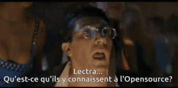

ifdef::conf-bdxio[]
=== Lectra
* Member of https://naos-cluster.com/
* Partner in the https://hermine-foss.org/ project
* Github : https://github.com/lectra-tech/
* Dockerhub : https://hub.docker.com/u/lectratech
endif::[]

ifdef::conf-webinar[]
=== Lectra
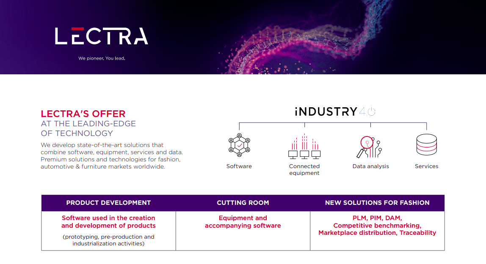

=== Lectra
image:images/lectra-numbers.png[width=800]

=== Opensource

[%step]
* Use Foss projects to build our solutions
** define a Foss policy to manage this usage
* Use Innersource projects
** incubator for future Opensource projects
* Contributor and creator of Opensource projects
** Partner in the https://hermine-foss.org/ project
** Kapoeira ...
endif::[]

== Take Away 🎁

=== Take Away 🎁

[%step]
* Discover a new tool to *test* your kafka streams
* Help you in your *communication* with PO/QA/DEV
* *Tips* to use it every day
* Have a good time (we hope)

== 📽️ Kapoeira story 🎬
image::images/cine.gif[width=800]

[.columns]
=== Connected Cutters

[.column]
image:images/vector.png[width=400]::
* Thousands of cutters
* Millions events every day

[.column width="30%"]

=== Apache Kafka
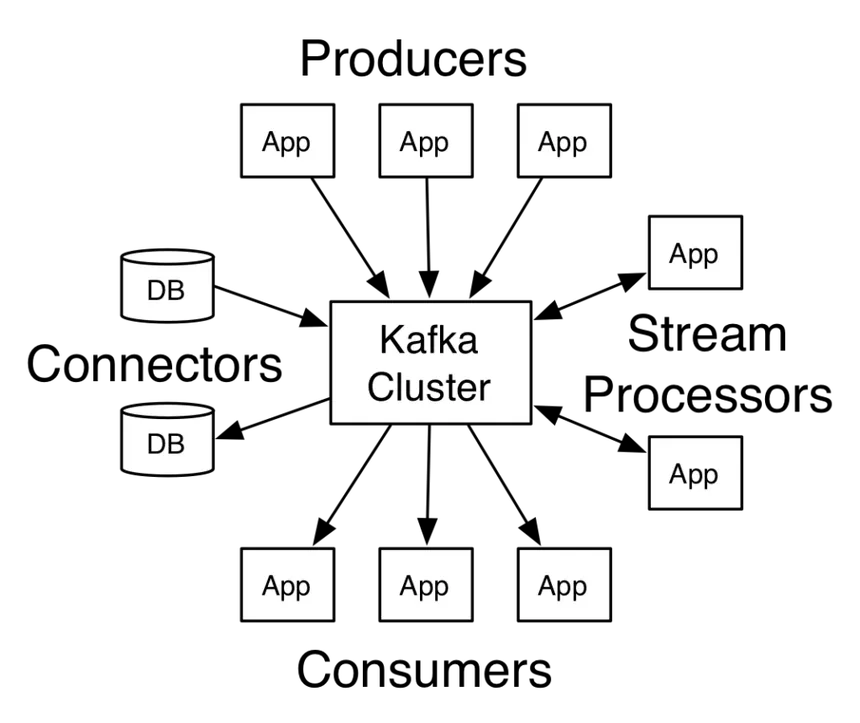

=== Our data pipeline

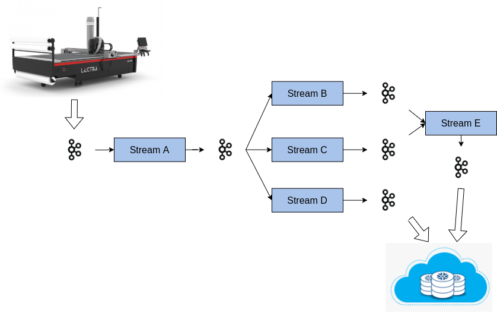

=== We are perfect !

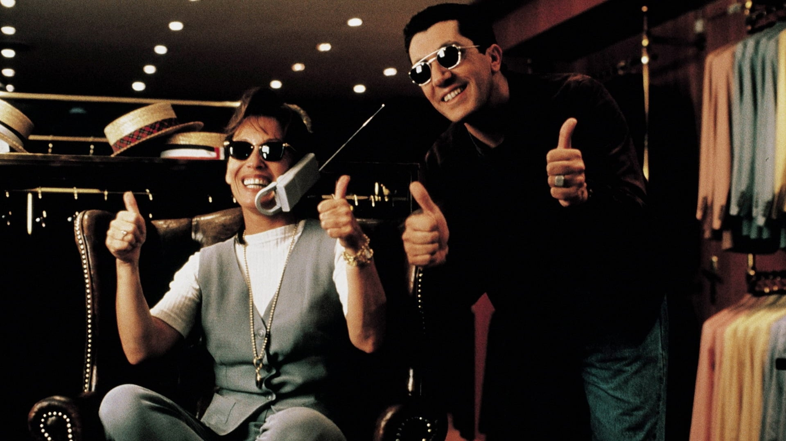

=== Data is perfect !

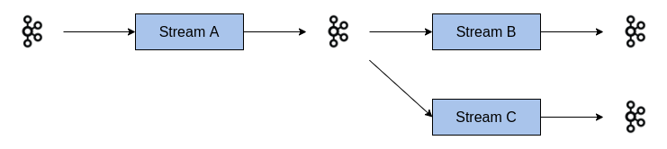

=== No bug in code !
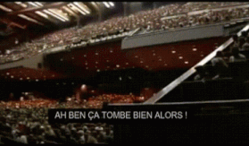

=== NO !

=== NO !
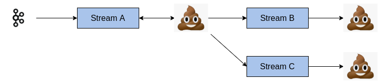

=== Data is 💩

=== Solution ?
TESTS OUR STREAMS!

=== How to test ?

https://docs.confluent.io/platform/current/streams/developer-guide/test-streams.html[TopologyTestDriver^]

Fast and efficient...

=== Scala Test Example

[source, scala]
----
include::code/topology-driver.scala[]
----

=== Happy 😀...🤮
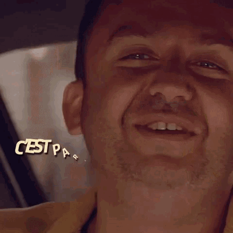

=== ... But mocked infra ≠ integration with Kafka

=== ... And only unit tests => How to test *several* streams ?

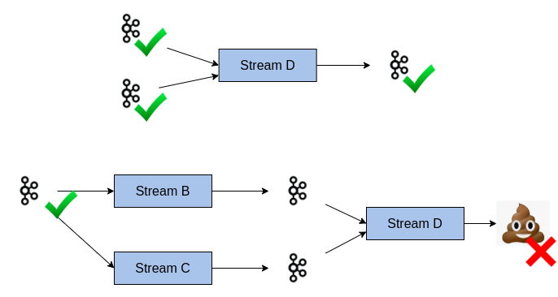

=== ... OK for Scala DEV but not for QA (=👮)

=== ... *Communication* between DEV/PO/QA ?

Acceptance tests !

== What do we need ?

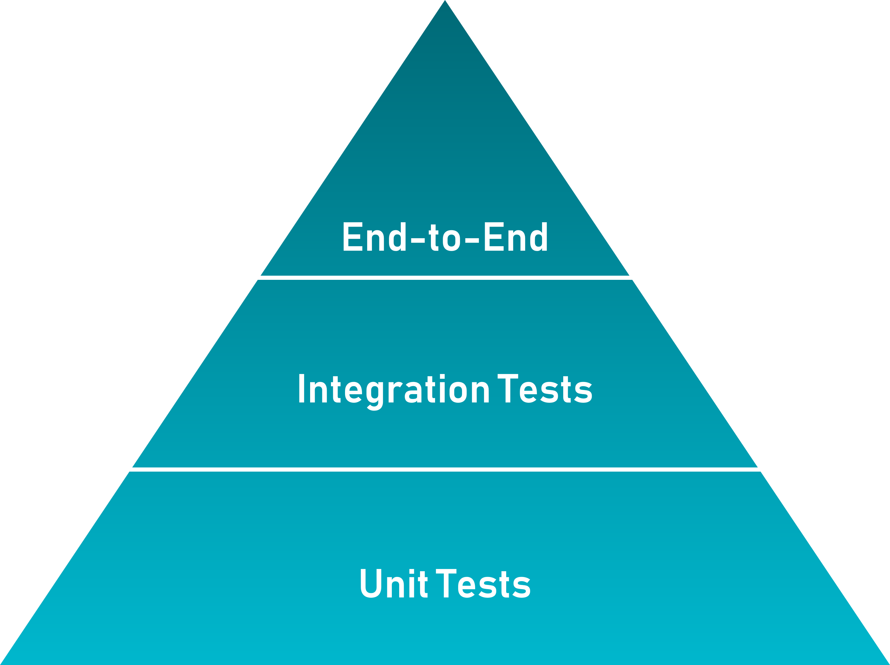 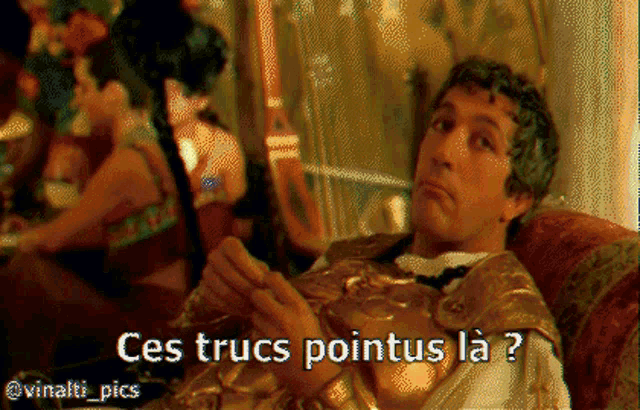

*Integration* tests with a *simple* syntax

[.columns]
=== Inspiration : Karate

[.column]

[.column]
* HTTP-based APIs
* Peter Thomas - 2017
* Simple syntax (https://cucumber.io/docs/gherkin/reference/[Gherkin^])
* https://youtu.be/Cnma3WbKvtE?si=TXYHGSpiib9SATIJ[Talk about Karate @BdxIO2018^]

=== Our context ≠ HTTP
image::images/kafkalogo.jpg[width=500]

Integration with *Kafka Streams* !

== What is Kapoeira?
.A Kapoeira Test
[source, gherkin]
----
include::features/example.feature[]
----

=== What is Kapoeira?
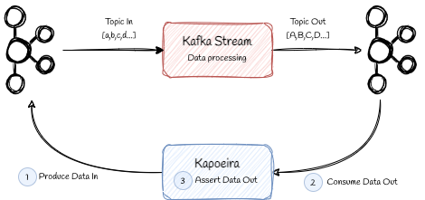

// TODO gif flux data
// step 0 sans kapo et flux données
// step 1 (background) kapo + create consumer & producer
// step 2 produce data 
// step 3 stream tranforme data en data2
// step 4 kapo + consume data2
// step 5 kapo assert

=== What is Kapoeira?
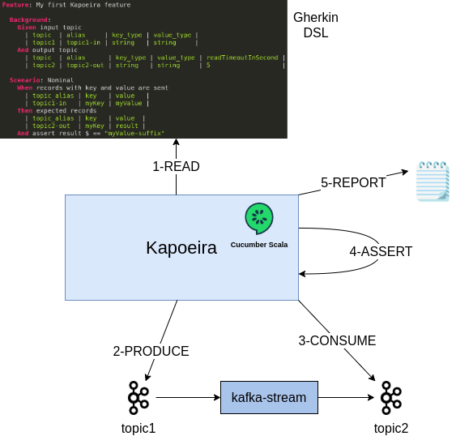

// TODO image drawio (à partir de kapoeira-diagram)

=== 2020 - Birth of Kapoeira

* Inner Source @Lectra
* First syntax created with a QA
* Cucumber calls Confluent CLI

=== CLI...
[source]
----
# Console producer
kafka-console-producer \
  --topic orders \
  --bootstrap-server broker:9092 \

# Console consumer
kafka-console-consumer \
  --topic orders \
  --bootstrap-server broker:9092 \
  --from-beginning
----

=== 2020 - Scala image:images/scala.svg[width=50]
* Specific Scala implementation for Kafka Consumer/Producer
* Better syntax with Gherkin Datatable

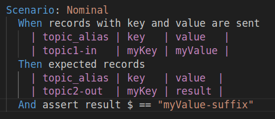

=== 2021 - ZIO - https://zio.dev/

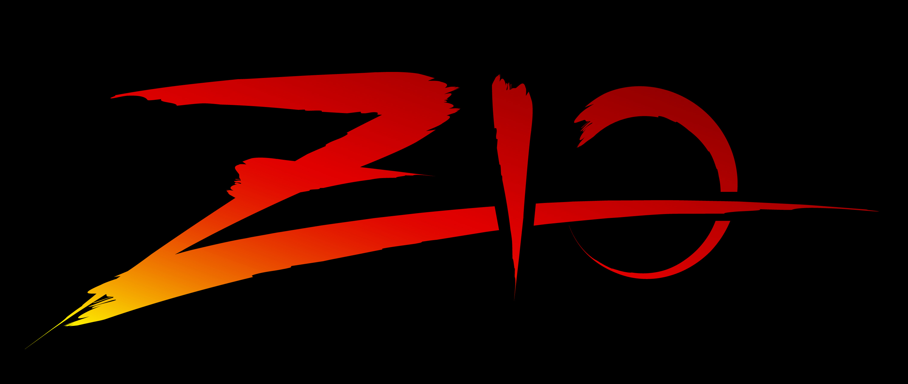

* To improve perfs
* Add parallel mode
* Batch to manage jointure in topics

=== 2023 - Open Source

icon:github[] https://github.com/lectra-tech/kapoeira

=== 2024 - New features

Thanks to you !

== Demo
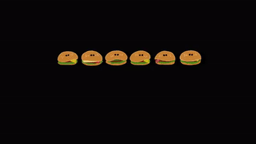

=== User Story n°1

* As a 🧑‍🍳
* GIVEN my fries-factory 
* WHEN I send a 🥔 to it
* THEN I expect to have 🍟

=== fries-factory 

=== User Story n°1 - Solution
* {burger-quiz-url}/fries-factory/it/features/fries-us1.0.feature[1st version^]
* {burger-quiz-url}/fries-factory/it/features/fries-us1.1-uuid.feature[With uuid^]
* {burger-quiz-url}/fries-factory/it/features/fries-us1.2-outline.feature[With Scenario Outline^]

[.columns]
=== User Story n°1 - Report
[.column]
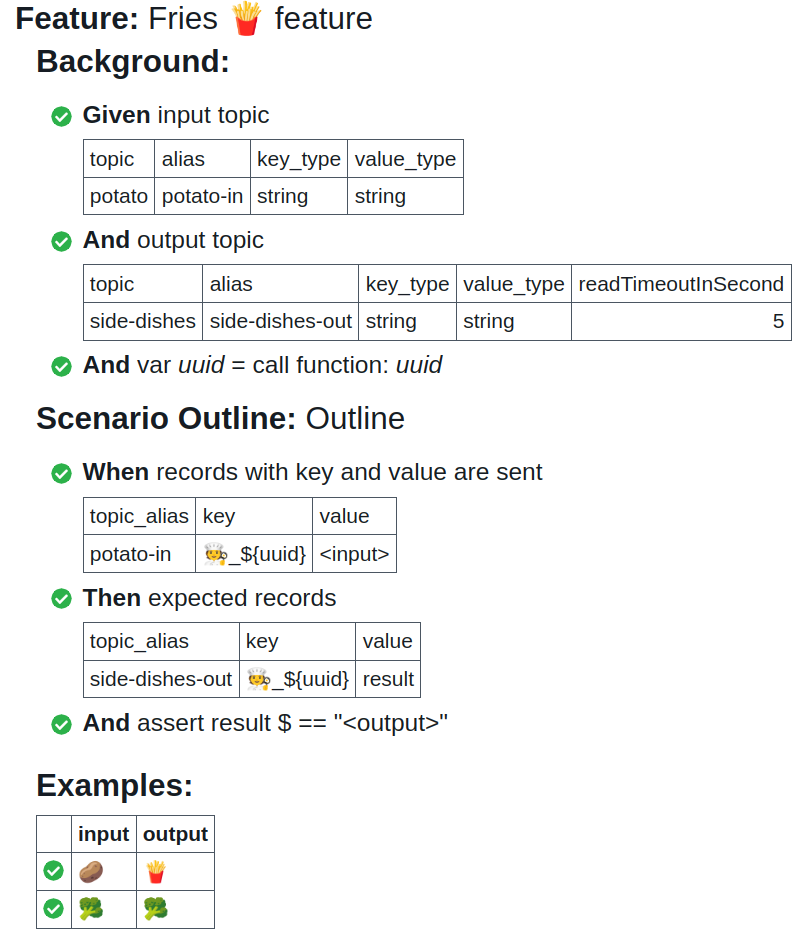

[.column]
 

=== User Story n°2

* As a 🧑‍🍳
* GIVEN my fries-factory
* WHEN I send 🥔🥔🥔🥔 to it
* THEN I expect to have 🍟🍟🍟🍟

=== User Story n°2 - Solution
* {burger-quiz-url}/fries-factory/it/features/fries-us2.0-files.feature[A feature...^]
* {burger-quiz-url}/fries-factory/it/features/records/potatoes.dat[... calling this file^]
* {burger-quiz-url}/fries-factory/it/features/fries-us2.1-files-tips.feature[A feature with a tip^]

=== User Story n°2 - Report
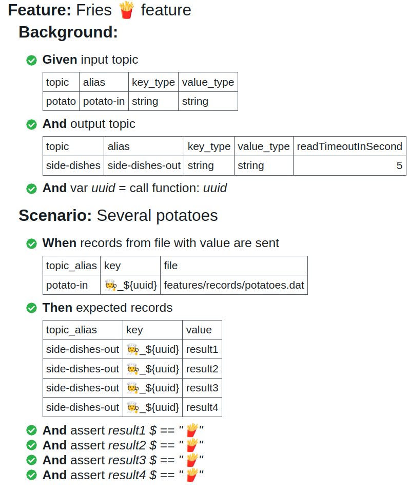

=== User Story n°3

* As a 🧑‍🍳
* GIVEN my fries-factory
* WHEN I send 🥔 to it, with [.red]#KETCHUP(🍅)# as Kafka Header
* THEN I expect to have a 🍟 with [.red]#KETCHUP(🍅)# as Kafka Header

=== User Story n°3 - Solution
* {burger-quiz-url}/fries-factory/it/features/fries-us3.feature[A feature...^]
* {burger-quiz-url}/fries-factory/it/features/records/potatoesWithHeaders.dat[... calling this file^]

=== User Story n°3 - Report
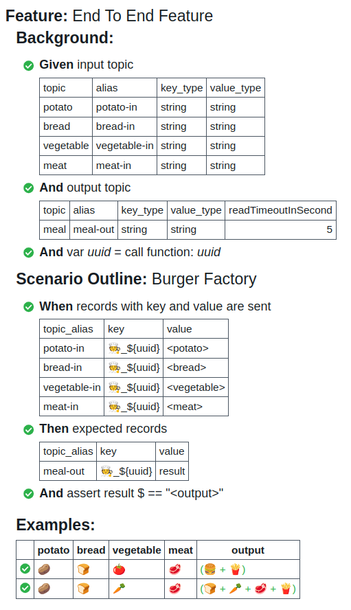

=== User Story n°4

* As a 🧑‍🍳
* GIVEN my burger-factory
* WHEN I send the ingredients (🍞,🍅,🥩) to it
* THEN I expect to have a delicious 🍔

=== burger-factory 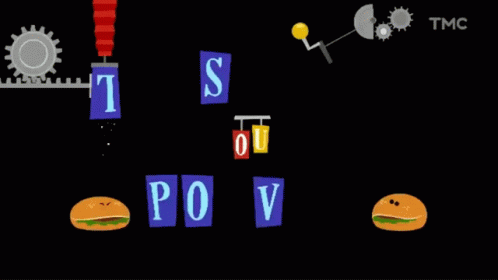
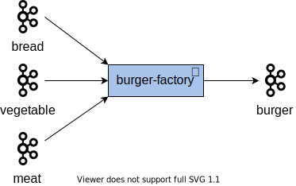

=== User Story n°4 - Solution
{burger-quiz-url}/burger-factory/it/features/burger-us4.feature[Here^]

=== User Story n°4 - Report
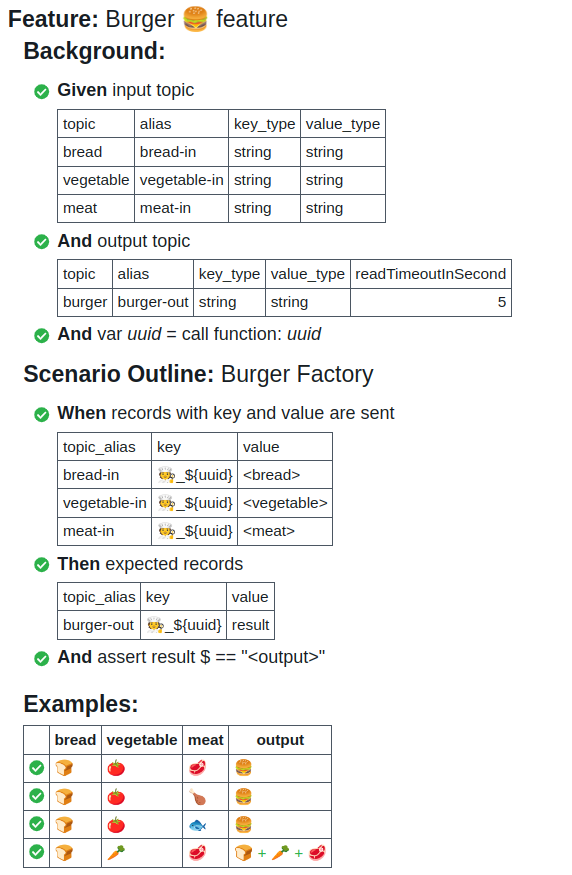

=== User Story n°5

* As a 🧑‍🍳
* GIVEN my meal-factory
* WHEN I send a 🍔 and some side dishes 🍟 to it
* THEN I expect to have a great meal (🍔 + 🍟)

=== meal-factory 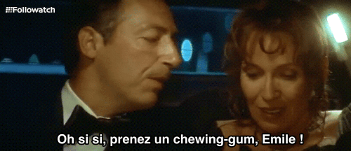
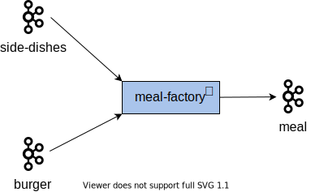

=== User Story n°5 - Solution
{burger-quiz-url}/meal-factory/it/features/meal-us5.feature[Here^]

=== User Story n°5 - Report
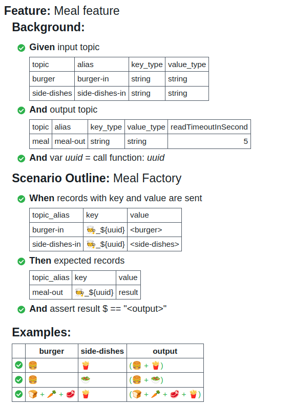

=== User Story n°6

* As a 🧑‍🍳
* GIVEN my burger-quiz
* WHEN I send the ingredients (🍞,🍅,🥩) and a 🥔 to it
* THEN I expect to have a great meal (🍔 + 🍟)

=== User Story n°6 
image::diagrams/burger-quiz.svg[width=800]

=== User Story n°6 - Solution
{burger-quiz-url}/end-to-end/it/features/end-to-end-us6.feature[Here^]

=== User Story n°6 - Report

== 🥦 REX 🥃

=== (Grand) REX  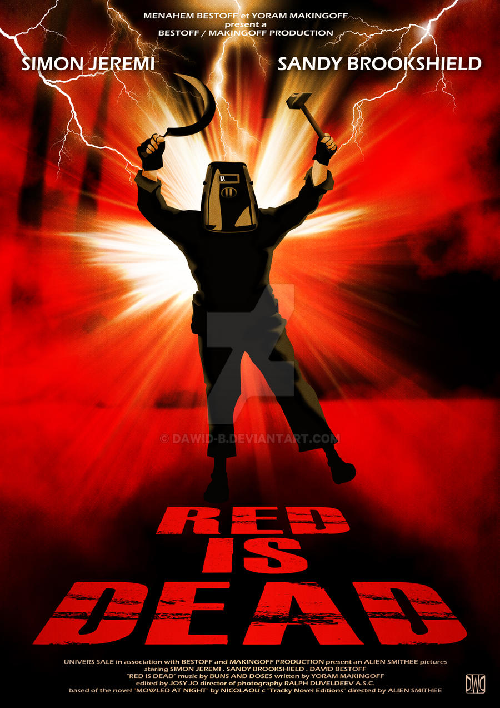

[%step]
* 👐 Big community in Lectra
* 🤝 Used as acceptance tests, specifications during story grooming
* ✏️ Easy for QA to enrich existing tests
* 🔄 Used as end-to-end tests

[.columns]
=== Advantages 💪

[.column]

[.column]
[%step]
* Kafka infra
* Simple to use
* Communicate with PO/QA/DEV
* Tests as documentation
* Tests as acceptance for stories

== Want to use it ? 👩‍🏭

=== How to use ? ⚒️

https://hub.docker.com/r/lectratech/kapoeira[^]

[source, bash]
----
docker run --rm -ti 
-v <PATH_TO_YOUR_FEATURES_FOLDER>:/features \
-e KAFKA_BOOTSTRAP_SERVER=<HOST:PORT[,HOST2:PORT2,HOST3:PORT3,...]> \
-e KAFKA_USER=<XXX> \
-e KAFKA_PASSWORD=<****> \
lectratech/kapoeira
----

=== More options

[source, bash]
----
docker run --rm -ti \
-v <PATH_TO_YOUR_FEATURES_FOLDER>:/features \
-v <PATH_TO_YOUR_REPORTS>:/reports \
-v /var/run/docker.sock:/var/run/docker.sock \
-e KAFKA_BOOTSTRAP_SERVER=<HOST:PORT[,HOST2:PORT2,HOST3:PORT3,...]> \
-e KAFKA_SCHEMA_REGISTRY_URL=<URL> \
-e JAAS_AUTHENT=<true(default) | false> \
-e KAFKA_USER=<XXX> \
-e KAFKA_PASSWORD=<****> \
-e LOGGING_LEVEL=<INFO (default) | ERROR | ...> \
-e THREADS=<8 (default) | ... > \
lectratech/kapoeira
----

=== How to contribute ? https://github.com/lectra-tech/kapoeira/blob/main/CONTRIBUTING.adoc[See here^] 

== Thank you !

[.columns]
=== Thanks for your feedback

[.column width="70%"]
icon:github[] https://github.com/lectra-tech/kapoeira[^] +
 +
icon:github[] https://jvauchel.github.io/[^] +
icon:github[] https://mrebiai.github.io/[^] +
ifdef::conf-webinar[]
icon:github[] https://github.com/fb33/[^] +
endif::[]
 +
icon:envelope[] vauchel.johanna@gmail.com +
icon:envelope[] mehdi.rebiai.dev@gmail.com +
ifdef::conf-webinar[]
icon:envelope[] f.barbe@lectra.com +
endif::[]

[.column width="30%"]
ifdef::conf-webinar[]

endif::[]
ifdef::conf-bdxio[]
TODO QR Code OpenFeedback
endif::[]