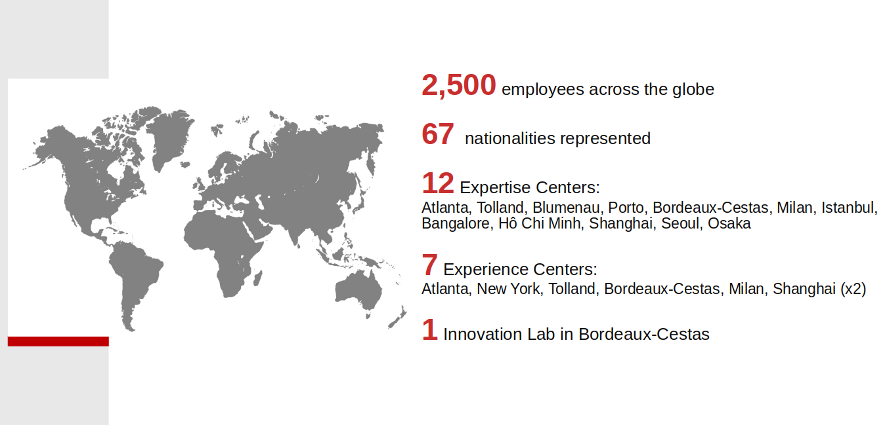

= 🕺Kapoeira💃
:source-highlighter: highlight.js
:highlightjs-languages: bash, gherkin, javascript, json, scala
:icons: font
:burger-quiz-url: https://github.com/jvauchel/kapoeira-dance/blob/main/burger-quiz

image::images/kapoeira.gif[]

// Tests d'intégration dans un environnement Kafka

// == Sommaire
// * Kapoeira
// * Syntaxe
// * Démo

== Presentation
image::images/hello.gif[width=500]

=== Presentation

Mehdi Rebiai::
* icon:github[] https://mrebiai.github.io/
* icon:envelope[] mehdi.rebiai.dev@gmail.com
* Techlead & Data engineer at https://www.lectra.com[Lectra^]

=== Presentation

image::images/odile.jpeg[width=400]

Johanna Vauchel::
* icon:github[] https://jvauchel.github.io/
* icon:envelope[] vauchel.johanna@gmail.com
* Data engineer at https://www.lectra.com[Lectra^] & speaker 🎤

ifdef::conf-webinar[]
=== Presentation
image::images/darmon.jpg[width=400]

François Barbe::
* icon:github[] https://github.com/fb33
* icon:envelope[] f.barbe@lectra.com
* Principal Architect at https://www.lectra.com[Lectra^]
endif::[]

== Opensource at Lectra
image::images/opensource.gif[width=500]

ifdef::conf-bdxio[]
=== Lectra
* Member of https://naos-cluster.com/
* Partner in the https://hermine-foss.org/ project
* Github : https://github.com/lectra-tech/
* Dockerhub : https://hub.docker.com/u/lectratech
endif::[]

ifdef::conf-webinar[]
=== Lectra
image::images/lectra-4.0.png[width=800]

=== Lectra

=== Opensource

[%step]
* Use Foss projects to build our solutions
** define a Foss policy to manage this usage
* Use Innersource projects
** incubator for future Opensource projects
* Contributor and creator of Opensource projects
** Partner in the https://hermine-foss.org/ project
** Kapoeira ...
endif::[]

== Take Away 🎁
image::images/take-away.gif[width=500]

=== Take Away 🎁

[%step]
* Discover a new tool to *test* your kafka streams
* Help you in your *communication* with PO/QA/DEV
* *Tips* to use it every day
* Have a good time (we hope)

== 📽️ Kapoeira story 🎬
image::images/cine.gif[width=800]

[.columns]
=== Vector

[.column]
image:images/vector.png[width=400]::
* Thousands of cutters
* Millions events every day

[.column width="30%"]
image::images/combien.gif[width=300]

=== Enrich and collect data

image::images/enrichData.png[width=800]

=== Data pipeline

image::images/data-pipeline.png[width=800]

=== We are perfect !

image::images/perfect.jpg[width=800]

=== Data is perfect !

image::images/pipeline-example.png[width=800]

=== No bug in code !
image::images/ca-tombe-bien.gif[width=600]

=== NO !
image::images/no-not.gif[width=600]

=== NO !
image::images/pipeline-example-poo.png[width=800]

=== Data is 💩
image::images/boucherie.gif[width=600]

=== Solution ?

TESTS OUR STREAMS!

=== How to test ?

https://docs.confluent.io/platform/current/streams/developer-guide/test-streams.html[TopologyTestDriver^]

image::images/fast.jpg[width=500]

Fast and efficient...

=== Scala Test Example

[source, scala]
----
include::code/topology-driver.scala[]
----

=== Happy 😀...🤮
image::images/content-vomi.gif[width=400]

=== ... But it's a mocked infrastructure

image::images/fail.jpeg[width=600]

It did not test the *integration* with the Kafka cluster

=== ... And only unit tests

image::images/end-to-end.png[width=600]

How to test *several* streams ?

=== ... And it's not for QA (=👮)

image::images/les-nuls-police.gif[width=500]

=== ... And it's technical code

image::images/simon-kara.gif[width=600]

How to *communicate* with DEV/PO/QA ?

== What do we need ?

image:images/test-pyramid.png[width=350] image:images/cesar-triangle.gif[width=350]

*Integration* tests with a *simple* syntax

[.columns]
=== Inspiration : Karate

[.column]
image::images/karate.png[width=200]

[.column]
* HTTP-based APIs
* Peter Thomas - 2017
* Simple syntax (https://cucumber.io/docs/gherkin/reference/[Gherkin^])
* https://youtu.be/Cnma3WbKvtE?si=TXYHGSpiib9SATIJ[Talk about Karate @BdxIO2018^]

=== Our context ≠ HTTP
image::images/kafkalogo.jpg[width=300]

Integration with *Kafka Streams* !

== What is Kapoeira?

Cucumber Scala using specific Gherkin DSL

image::images/cucumber.png[width=200]

=== What is Gherkin ?

[source, gherkin]
----
include::features/CucumberExample.feature[]
----

=== What is Cucumber ?

[source, scala]
----
include::code/CucumberStepDef.scala[]
----

=== How does it work ?

image::images/archi.png[width=400]

=== How does it work ?

image::images/kapoeira-diagram.png[width=600]

=== 2020 - Birth of Kapoeira
image::images/young-chabat.jpg[width=300]

* Inner Source @Lectra
* First syntax created with a QA
* Cucumber calls Confluent CLI

=== CLI...
[source]
----
# Console producer
kafka-console-producer \
  --topic orders \
  --bootstrap-server broker:9092 \

# Console consumer
kafka-console-consumer \
  --topic orders \
  --bootstrap-server broker:9092 \
  --from-beginning
----

=== 2020 - Scala !
image::images/scala.jpg[width=300]
* Specific Scala implementation for Kafka Consumer/Producer
* Better syntax with Gherkin Datatable

=== 2021 - ZIO - https://zio.dev/

image::images/zio.jpeg[width=300]

* To improve perfs
* Add parallel mode
* Batch to manage jointure in topics

=== 2023 - Open Source

image::images/kapoeira_logo_text.png[width=200]

icon:github[] https://github.com/lectra-tech/kapoeira

=== 2024 - New features

image::images/simon.jpeg[width=200]

Thanks to you !

== Demo
image::images/burger-quiz.gif[width=500]

=== User Story n°1

* As a 🧑‍🍳
* GIVEN my fries-factory 
* WHEN I send a 🥔 to it
* THEN I expect to have 🍟

=== fries-factory 

=== User Story n°1 - Solution
* {burger-quiz-url}/fries-factory/it/features/fries-us1.feature[1st version^]
* {burger-quiz-url}/fries-factory/it/features/fries-us1-uuid.feature[With uuid^]
* {burger-quiz-url}/fries-factory/it/features/fries-us1-outline.feature[With Scenario Outline^]

=== User Story n°2

* As a 🧑‍🍳
* GIVEN my fries-factory
* WHEN I send 🥔🥔🥔 to it
* THEN I expect to have 🍟🍟🍟

=== User Story n°2 - Solution
* {burger-quiz-url}/fries-factory/it/features/fries-us2-files.feature[A feature...^]
* {burger-quiz-url}/fries-factory/it/features/records/potatoes.dat[... calling this file^]

=== User Story n°3

* As a 🧑‍🍳
* GIVEN my fries-factory
* WHEN I send 🥔 to it, with [.red]#KETCHUP(🍅)# Kafka Header
* THEN I expect to have a 🍟 with [.red]#KETCHUP(🍅)#

=== User Story n°3 - Solution
{burger-quiz-url}/fries-factory/it/features/fries-us3.feature[Here^]

=== User Story n°4

* As a 🧑‍🍳
* GIVEN my burger-factory
* WHEN I send the ingredients (🍞,🍅,🥩) to it
* THEN I expect to have a delicious 🍔

=== burger-factory image:images/sel-poivre.gif[width=200,float=right]
image::diagrams/burger-factory.svg[width=800]

=== meal-factory image:images/chewing-gum.gif[width=300,float=right]

=== burger-quiz image:images/burger-quiz.gif[width=200,float=right]
// TODO tests end2end

image::diagrams/burger-quiz.svg[width=800]

// Note

// Frite simple patate => une frite (v1 sans uuid)
// Fichier : plusieurs patates dans un fichier => une frite par patate

// Header : Mayo/ Ketchup en header => et en sortie header Mayo et Header

// internal function: on ajoute le uuid

// Tests end-to-end et batching : fries + burger factory

// lot de records : burger mais à simplifier (side dishes à enlever

// call script ?$

// assertion : output = value/price ???

// feature à évoquer sans demo : avro/json schema, external script

// demo avec QA/PO/DEV, publique, on part d'une story, on écrit le test, il marche pas (report KO), on débloque le code qui fonctionne, le report est vert

// === Fries.feature
// [source, gherkin]
// ----
// include::features/fries-us1.feature[]
// ----
//
// === An architecture
// image::diagrams/burger-quiz.svg[width=800]
//
// === Docker commands
// ----
// docker compose build --no-cache
// docker compose up -d
// docker restart kapoeira
// ----
//
// === burger.feature
// [source, gherkin]
// ----
// include::features/burger.feature[]
// ----
//
// === meal.feature
// [source, gherkin]
// ----
// include::features/meal.feature[]
// ----
//
//
//
// == Advanced example
//
// [source, gherkin]
// ----
// include::features/example.feature[]
// ----
//
// // explication feature, scenario, background, .....
//
=== Report
image:images/rapport.gif[width=400] image:images/report.png[width=450]

== 🥦 REX 🥃

image::images/whisky.gif[width=500]

=== (Grand) REX  

[%step]
* 👐 Big community in Lectra
* 🤝 Used as acceptance tests, specifications during story grooming
* ✏️ Easy for QA to enrich existing tests
* 🔄 Used as end-to-end tests

[.columns]
=== Advantages 💪

[.column]

[.column]
[%step]
* Kafka infra
* Simple to use
* Communicate with PO/QA/DEV
* Tests as documentation
* Tests as acceptance for stories

== Want to use it ? 👩‍🏭

image::images/banco.gif[width=500]

=== How to use ? ⚒️

https://hub.docker.com/r/lectratech/kapoeira[^]

[source, bash]
----
docker run --rm -ti 
-v <PATH_TO_YOUR_FEATURES_FOLDER>:/features \
-e KAFKA_BOOTSTRAP_SERVER=<HOST:PORT[,HOST2:PORT2,HOST3:PORT3,...]> \
-e KAFKA_USER=<XXX> \
-e KAFKA_PASSWORD=<****> \
lectratech/kapoeira
----

=== More options

[source, bash]
----
docker run --rm -ti \
-v <PATH_TO_YOUR_FEATURES_FOLDER>:/features \
-v /var/run/docker.sock:/var/run/docker.sock \
-e KAFKA_BOOTSTRAP_SERVER=<HOST:PORT[,HOST2:PORT2,HOST3:PORT3,...]> \
-e KAFKA_SCHEMA_REGISTRY_URL=<URL> \
-e JAAS_AUTHENT=<true(default) | false> \
-e KAFKA_USER=<XXX> \
-e KAFKA_PASSWORD=<****> \
-e LOGGING_LEVEL=<INFO (default) | ERROR | ...> \
-e THREADS=<8 (default) | ... > \
lectratech/kapoeira
----

=== How to contribute ? https://github.com/lectra-tech/kapoeira/blob/main/CONTRIBUTING.adoc[See here^] 
image::images/contribute.gif[width=500]

== Thank you !

[.columns]
=== Thanks for your feedback

[.column]
icon:github[] https://jvauchel.github.io/ +
icon:github[] https://mrebiai.github.io/ +
ifdef::conf-webinar[]
icon:github[] https://github.com/fb33/ +
endif::[]
 +
icon:envelope[] vauchel.johanna@gmail.com +
icon:envelope[] mehdi.rebiai.dev@gmail.com +
ifdef::conf-webinar[]
icon:envelope[] f.barbe@lectra.com +
endif::[]

[.column width="30%"]
ifdef::conf-webinar[]
image::images/WebinarQRCode.png[width=200]
endif::[]
ifdef::conf-bdxio[]
TODO QR Code OpenFeedback
endif::[]