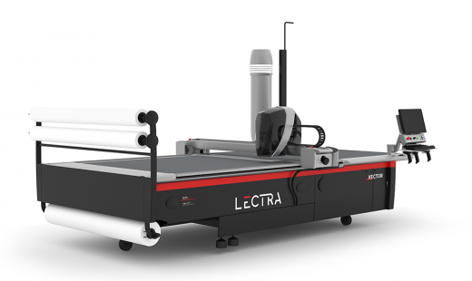
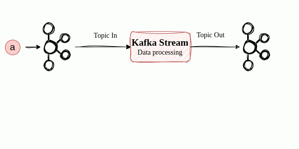
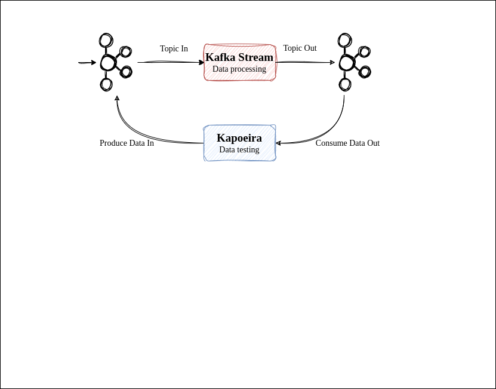
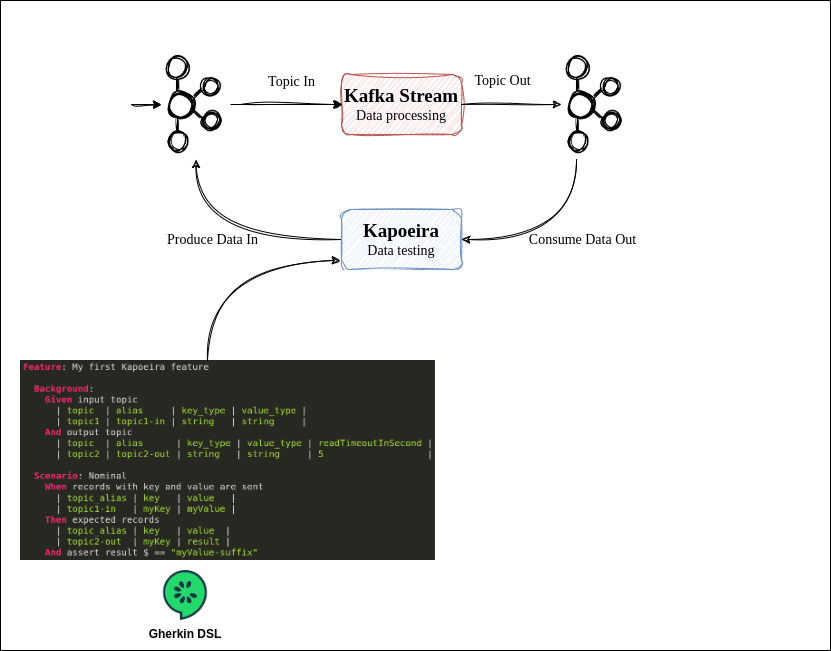
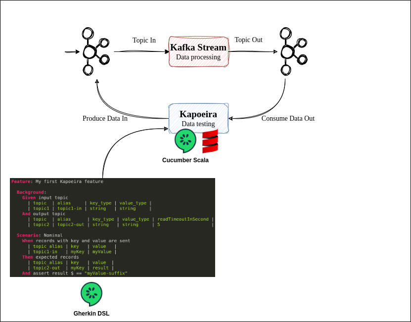
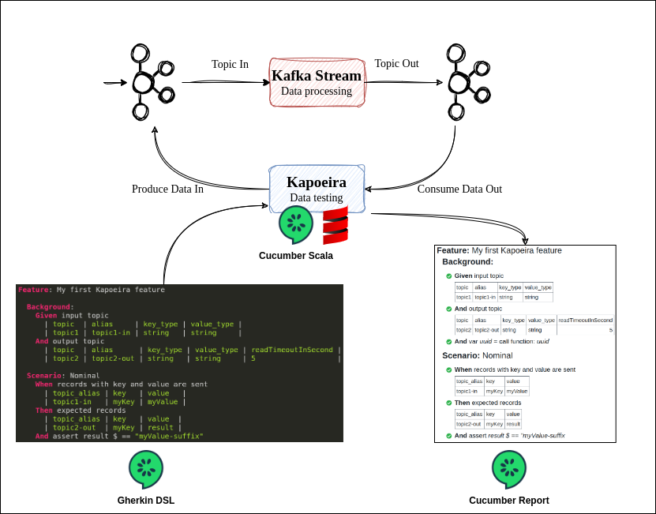

= 🕺image:images/kapoeira_logo_text.png[width=200]💃
:source-highlighter: highlight.js
:highlightjs-languages: bash, gherkin, javascript, json, scala
:icons: font
:burger-quiz-url: https://github.com/jvauchel/kapoeira-dance/blob/main/burger-quiz

image::images/kapoeira.gif[]

== Presentation

=== Presentation
image::images/kara.jpeg[width=300]

Mehdi Rebiai::
* icon:github[] https://mrebiai.github.io/[^]
* icon:envelope[] mehdi.rebiai.dev@gmail.com
* Techlead & Data engineer at https://www.lectra.com[Lectra^]

=== Presentation

image::images/odile.jpeg[width=400]

Johanna Vauchel::
* icon:github[] https://jvauchel.github.io/[^]
* icon:envelope[] vauchel.johanna@gmail.com
* Data engineer at https://www.lectra.com[Lectra^] & speaker 🎤

ifdef::conf-webinar[]
=== Presentation
image::images/darmon.jpg[width=400]

François Barbe::
* icon:github[] https://github.com/fb33[^]
* icon:envelope[] f.barbe@lectra.com
* Principal Architect at https://www.lectra.com[Lectra^]
endif::[]

== Opensource at Lectra

ifdef::conf-bdxio[]
=== Lectra
* Member of https://naos-cluster.com/
* Partner in the https://hermine-foss.org/ project
* Github : https://github.com/lectra-tech/
* Dockerhub : https://hub.docker.com/u/lectratech
endif::[]

ifdef::conf-webinar[]
=== Lectra
image::images/lectra-4.0.png[width=800]

=== Lectra
image:images/lectra-numbers.png[width=800]

=== Opensource

[%step]
* Use Foss projects to build our solutions
** define a Foss policy to manage this usage
* Use Innersource projects
** incubator for future Opensource projects
* Contributor and creator of Opensource projects
** Partner in the https://hermine-foss.org/ project
** Kapoeira ...
endif::[]

== Take Away 🎁

=== Take Away 🎁

[%step]
* Discover a new tool to *test* your kafka streams
* Help you in your *communication* with PO/QA/DEV
* *Tips* to use it every day
* Have a good time (we hope)

== 📽️ Kapoeira story 🎬
image::images/cine.gif[width=800]

[.columns]
=== Connected Cutters

[.column]
::
* Thousands of cutters
* Millions events every day

[.column width="30%"]

=== Apache Kafka

=== Our data pipeline

image::images/data-pipeline.png[width=800]

=== We are perfect !

=== Data is perfect !

image::images/pipeline-example.png[width=800]

=== No bug in code !

=== NO !
image::images/no-not.gif[width=600]

=== NO !
image::images/pipeline-example-poo.png[width=800]

=== Data is 💩

=== Solution ?
TESTS OUR STREAMS!

=== How to test ?

https://docs.confluent.io/platform/current/streams/developer-guide/test-streams.html[TopologyTestDriver^]

image::images/fast.jpg[width=500]

Fast and efficient...

=== Scala Test Example

[source, scala]
----
include::code/topology-driver.scala[]
----

=== Happy 😀...🤮
image::images/content-vomi.gif[width=400]

=== ... But mocked infra ≠ integration with Kafka

image::images/fail.jpeg[width=600]

=== ... And only unit tests => How to test *several* streams ?

image::images/end-to-end.png[width=600]

=== ... OK for Scala DEV but not for QA (=👮)

image::images/les-nuls-police.gif[width=400]

=== ... *Communication* between DEV/PO/QA ?

image::images/simon-kara.gif[width=600]

Acceptance tests !

== What do we need ?

image:images/test-pyramid.png[width=350] image:images/cesar-triangle.gif[width=350]

*Integration* tests with a *simple* syntax

[.columns]
=== Inspiration : Karate

[.column]
image::images/karate.png[width=200]

[.column]
* HTTP-based APIs
* Peter Thomas - 2017
* Simple syntax (https://cucumber.io/docs/gherkin/reference/[Gherkin^])
* https://youtu.be/Cnma3WbKvtE?si=TXYHGSpiib9SATIJ[Talk about Karate @BdxIO2018^]

=== Our context ≠ HTTP
image::images/kafkalogo.jpg[width=500]

Integration with *Kafka Streams* !

== What is Kapoeira?
.A Kapoeira Test
[source, gherkin]
----
include::features/example.feature[]
----

=== What is Kapoeira?

=== What is Kapoeira?

=== What is Kapoeira?

=== What is Kapoeira?

=== What is Kapoeira?

=== 2020 - Birth of Kapoeira
image::images/young-chabat.jpg[width=300]

* Inner Source @Lectra
* First syntax created with a QA
* Cucumber calls Confluent CLI

=== CLI...
[source]
----
# Console producer
kafka-console-producer \
  --topic orders \
  --bootstrap-server broker:9092 \

# Console consumer
kafka-console-consumer \
  --topic orders \
  --bootstrap-server broker:9092 \
  --from-beginning
----

=== 2020 - Scala image:images/scala.svg[width=50]
* Specific Scala implementation for Kafka Consumer/Producer
* Better syntax with Gherkin Datatable

=== 2021 - ZIO - https://zio.dev/

image::images/zio.jpeg[width=300]

* To improve perfs
* Add parallel mode
* Batch to manage jointure in topics

=== 2023 - Open Source

image::images/kapoeira_logo_text.png[width=200]

icon:github[] https://github.com/lectra-tech/kapoeira

🐳 https://hub.docker.com/r/lectratech/kapoeira[^]

=== How to run 

[source, bash]
----
docker run --rm -ti 
-v <PATH_TO_YOUR_FEATURES_FOLDER>:/features \
-e KAFKA_BOOTSTRAP_SERVER=<HOST:PORT[,HOST2:PORT2,HOST3:PORT3,...]> \
-e KAFKA_USER=<XXX> \
-e KAFKA_PASSWORD=<****> \
lectratech/kapoeira
----

=== 2024 - New features

Thanks to you !

== Demo

=== Demo pipeline 
image::diagrams/burger-quiz.svg[width=800]

=== Demo docker-compose image:images/docker-compose.png[width=100]

https://github.com/jvauchel/kapoeira-dance/blob/main/docker-compose.yml[here^]

=== Focus on fries image:images/patate.gif[width=300,float=right]
image::diagrams/fries-factory.svg[width=800]

=== User Story n°1

* As a 🧑‍🍳
* GIVEN my fries-factory 
* WHEN I send a 🥔 to it
* THEN I expect to have 🍟

{burger-quiz-url}/fries-factory/it/features/fries-us1.feature[Solution^]

[.columns]
=== User Story n°1 - Report
[.column]
image::images/report-us1.2.png[width=450]

[.column]
 

=== Focus on burger 
image::diagrams/burger-factory.svg[width=800]

=== User Story n°2

* As a 🧑‍🍳
* GIVEN my burger-factory
* WHEN I send the ingredients (🍞,🍅,🥩) to it
* THEN I expect to have a delicious 🍔

{burger-quiz-url}/burger-factory/it/features/burger-us2.feature[Solution^]

=== User Story n°2 - Report

=== Focus on end-to-end test 
image::diagrams/burger-quiz.svg[width=800]

=== User Story n°3

* As a 🧑‍🍳
* GIVEN my burger-quiz pipeline
* WHEN I send the ingredients (🍞,🍅,🥩) and a 🥔 to it
* THEN I expect to have a great meal (🍔 + 🍟)

{burger-quiz-url}/end-to-end/it/features/end-to-end-us3.feature[Solution^]

=== User Story n°3 - Report
image::images/report-us6.png[width=325]

[.columns]
=== Other features

[.column width="70%"]

[.column width="30%"]
* https://github.com/lectra-tech/kapoeira#75-assertions[Assertion json path]
* https://github.com/lectra-tech/kapoeira#751-headers[Header kafka]
* https://github.com/lectra-tech/kapoeira#77-call-scripts[Call external scripts]
* https://github.com/lectra-tech/kapoeira#73-avro-and-json-schema[Avro, json format message]
* https://github.com/lectra-tech/kapoeira#78-produce--consume-with-batches[Batch of records]

== 🥦 REX 🥃

=== (Grand) REX  image:images/red-is-dead.jpg[width=100]

[%step]
* 👐 Big community in Lectra
* 🤝 Used as acceptance tests, specifications during story grooming
* ✏️ Easy for QA to enrich existing tests
* 🔄 Used as end-to-end tests

[.columns]
=== Advantages 💪

[.column]
image::images/bluff.gif[width=500]

[.column]
[%step]
* Kafka infra
* Simple to use
* Communicate with PO/QA/DEV
* Tests as documentation
* Tests as acceptance for stories

== Ready to use it ? 👩‍🏭

image::images/banco.gif[width=500]

=== Ready to contribute ? https://github.com/lectra-tech/kapoeira/blob/main/CONTRIBUTING.adoc[See here^] 
image::images/contribute.gif[width=500]

== Thank you !

image::images/cauchemar.gif[width=500]

[.columns]
=== Thanks for your feedback

[.column width="70%"]
icon:github[] https://github.com/lectra-tech/kapoeira[^] +
 +
icon:github[] https://jvauchel.github.io/[^] +
icon:github[] https://mrebiai.github.io/[^] +
ifdef::conf-webinar[]
icon:github[] https://github.com/fb33/[^] +
endif::[]
 +
icon:envelope[] vauchel.johanna@gmail.com +
icon:envelope[] mehdi.rebiai.dev@gmail.com +
ifdef::conf-webinar[]
icon:envelope[] f.barbe@lectra.com +
endif::[]

[.column width="30%"]
ifdef::conf-webinar[]
image::images/WebinarQRCode.png[width=200]
endif::[]
ifdef::conf-bdxio[]
TODO QR Code OpenFeedback
endif::[]

// TODO report (mettre code à coté ?)
// Est-ce qu'on garde le impl false et true ? Voire pas démarrer le service (intéractif en montrant le docker compose)
// toto dans report afficher que le outline en gros (burger)
// todo gif flux kafka stream
// TODO open feedback changer heure de fin
// todo enlever qr code à la fin car open feedback
//