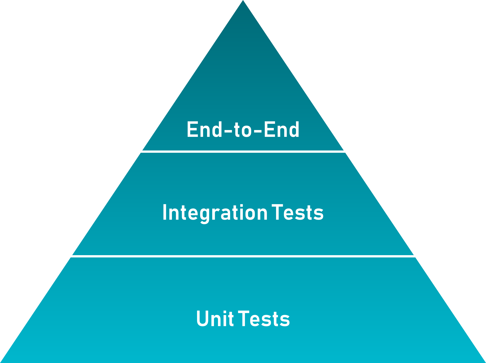

= 🌴Kapoeira🕺💃
:source-highlighter: highlightjs
:highlightjs-languages: bash, gherkin, javascript, json

image::images/kapoeira.gif[]

// Tests d'intégration dans un environnement Kafka

// == Sommaire
// * Kapoeira
// * Syntaxe
// * Démo

== Kapoeira 🤔 ?

=== Integration Tests

=== Kafka Stream

image::images/kafkalogo.jpg[width=300]

=== Once upon a time

=== Enrich and collect data

image:images/enrichData.png[width=800]

=== How to test ?

https://docs.confluent.io/platform/current/streams/developer-guide/test-streams.html[TopologyTestDriver]

Fast and efficient...

=== ... But

[%step]
* it did not test the integration with the Kafka cluster
* not a tool for QA, only for dev
* how to test several streams ?
* how to communicate with DEV/PO/QA ?

[.columns]
=== Need a tool similar to Karate

[.column]

[.column]
* HTTP-based APIs
* simple syntax (https://cucumber.io/docs/gherkin/reference/[Gherkin])

== Birth of Kapoeira

=== 2020

* Inner tool
* console-script confluent

=== 202x ZIO

image:images/zio.jpeg[width=300]

=== 2023 Open Source

== Inside Kapoeira

Cucumber Scala, using specific Gherkin DSL.

image:images/cucumber.png[width=200]

=== How does it work ?

image:images/kapoeira-diagram.png[width=500]

=== Example

[source, gherkin]
----
include::features/example.feature[]
----

=== Report

image:images/report.png[width=500]

=== REX

=== Advantages

* simple to use
* tool to communicate
* documentation
* acceptance tests

== How to use ?

// === Story Telling
// * C'est quoi
// ** outil TI Kafka
//
// * Pourquoi
// ** tests topo driver insuffisants, pas d'outil sur le marché, QA pas outillé
// ** on recherche un outil pour communiquer en DEV/QA/PO

// * Histoire
// ** Inspiration Karate (et Gherkin)
// ** Naissance en 2020 (1ere implem naive, basé sur console-script confluent)
// ** Utilisation de ZIO dès 202x (pour améloration perf)

// * Explication syntaxe
// ** Simple d'utilisation et utilisable par tous
//
// * Utilisation
//
// * Démo
//
// * REX Kapo dans notre quotidien
// ** Niveau d'adoption
// ** Utilisation dès spec pour test d'acceptance
// ** Facilité d'enrichissement de test apres les DEV
// ** Définition de tests End2End
//
// * Contribution

// === Tests d'intégration dans un environnement Kafka
// image::https://raw.githubusercontent.com/lectra-tech/kapoeira/main/docs/diagrams/kapoeira.png[]
//
// === Les origines...
// * Contexte Lectra
// * Inner Source puis OpenSource

// == Syntaxe
// TODO

== Démo

=== Architecture
image::diagrams/burger-quiz.svg[width=800]

=== Docker commands
----
docker compose build --no-cache
docker compose up -d
docker restart kapoeira
----

=== burger.feature
[source, gherkin]
----
include::features/burger.feature[]
----

=== meal.feature
[source, gherkin]
----
include::features/meal.feature[]
----