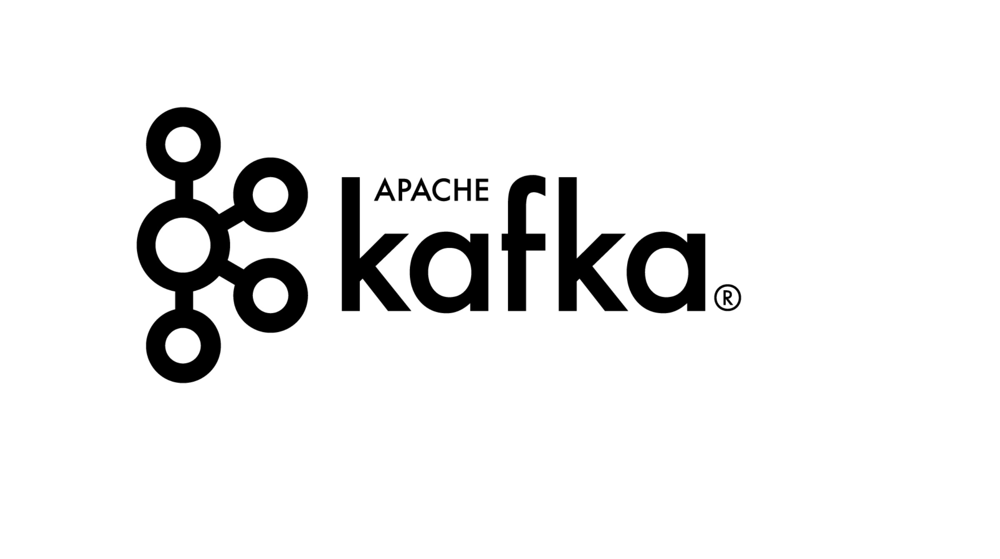

= 🌴Kapoeira🕺💃
:source-highlighter: highlightjs
:highlightjs-languages: bash, gherkin, javascript, json

image::images/kapoeira.gif[]

// Tests d'intégration dans un environnement Kafka

// == Sommaire
// * Kapoeira
// * Syntaxe
// * Démo

== Presentation

image::images/kara.jpeg[width=300]

Mehdi Rebiai::
* icon:github[] https://github.com/mrebiai
* icon:envelope[] mehdi.rebiai.dev@gmail.com
* Techlead & Data engineer at https://www.lectra.com[Lectra]

== Presentation

Johanna Vauchel::
* icon:github[] https://mrebiai.github.io/
* icon:envelope[] vauchel.johanna@gmail.com
* Data engineer at https://www.lectra.com[Lectra]

=== 🎬 Kapoeira story 📽️

=== Enrich and collect data

image:images/enrichData.png[width=800]

=== We are perfect

image:images/perfect.jpg[width=800]

=== NO !

TODO schéma si bug ici, bug dans les streams suivants
avec mermaid

=== Solution ?

TESTS !

=== How to test ?

https://docs.confluent.io/platform/current/streams/developer-guide/test-streams.html[TopologyTestDriver]

Fast and efficient...

=== ... But

image:images/fail.jpeg[width=600]

it did not test the integration with the Kafka cluster

=== ... But

how to test several streams ?

(individually OK but together KO)

=== ... But it's not for QA

image:images/les-nuls-police.gif[width=600]

Listen, let's DEV do their job !

=== ... But it's code

image:images/simon-kara.gif[width=600]

how to communicate with DEV/PO/QA ?

== What do we need ?

Integration tests with simple syntax

[.columns]
=== Inspiration : Karate

[.column]
image:images/karate.png[width=200]

[.column]
* HTTP-based APIs
* Peter Thomas - 2017
* simple syntax (https://cucumber.io/docs/gherkin/reference/[Gherkin])

== Birth of Kapoeira

=== Kapoeira 🤔 ?

=== Integration Tests

image::images/test-pyramid.png[width=300]

=== Kafka Stream

=== 2020

* Inner tool
* console-script confluent

=== 202x ZIO

image:images/zio.jpeg[width=300]

=== 2023 Open Source

image:images/kapoeira_logo_text.png[width=300]

== Inside Kapoeira

Cucumber Scala, using specific Gherkin DSL.

image:images/cucumber.png[width=200]

=== How does it work ?

image:images/kapoeira-diagram.png[width=500]

=== Example

[source, gherkin]
----
include::features/example.feature[]
----

// explication feature, scenario, background, .....

=== Report

image:images/report.png[width=500]

=== REX

// * REX Kapo dans notre quotidien
// ** Niveau d'adoption
// ** Utilisation dès spec pour test d'acceptance
// ** Facilité d'enrichissement de test apres les DEV
// ** Définition de tests End2End

=== Advantages

image:images/advantages.gif[width=500]

=== Advantages

* test infra
* simple to use
* tool to communicate
* documentation
* acceptance tests

== How to use ?

image:images/banco.gif[width=500]

== How to build ?

----
docker build -t kapoeira:latest .
----

== How to use ?

https://hub.docker.com/r/lectratech/kapoeira[Docker Hub image]

----
docker run --rm -ti \
-v <PATH_TO_YOUR_FEATURES_FOLDER>:/features \
-v /var/run/docker.sock:/var/run/docker.sock \
-e KAFKA_BOOTSTRAP_SERVER=<HOST:PORT[,HOST2:PORT2,HOST3:PORT3,...]> \
-e KAFKA_SCHEMA_REGISTRY_URL=<URL> \
-e KAFKA_USER=<XXX> \
-e KAFKA_PASSWORD=<****> \
-e JAAS_AUTHENT=<true (default) | false> \
-e LOGGING_LEVEL=<INFO (default) | ERROR | ...> \
-e THREADS=<8 (default) | ... > \
lectratech/kapoeira
----

== How to contribute ?

TODO

// === Story Telling
// * C'est quoi
// ** outil TI Kafka
//
// * Pourquoi
// ** tests topo driver insuffisants, pas d'outil sur le marché, QA pas outillé
// ** on recherche un outil pour communiquer en DEV/QA/PO

// * Histoire
// ** Inspiration Karate (et Gherkin)
// ** Naissance en 2020 (1ere implem naive, basé sur console-script confluent)
// ** Utilisation de ZIO dès 202x (pour améloration perf)

// * Explication syntaxe
// ** Simple d'utilisation et utilisable par tous
//
// * Utilisation
//
// * Démo
//
// * REX Kapo dans notre quotidien
// ** Niveau d'adoption
// ** Utilisation dès spec pour test d'acceptance
// ** Facilité d'enrichissement de test apres les DEV
// ** Définition de tests End2End
//
// * Contribution

// === Tests d'intégration dans un environnement Kafka
// image::https://raw.githubusercontent.com/lectra-tech/kapoeira/main/docs/diagrams/kapoeira.png[]
//
// === Les origines...
// * Contexte Lectra
// * Inner Source puis OpenSource

// == Syntaxe
// TODO

== Démo
image::images/buger-quiz.gif[]

=== Architecture
image::diagrams/burger-quiz.svg[width=800]

=== Docker commands
----
docker compose build --no-cache
docker compose up -d
docker restart kapoeira
----

=== burger.feature
[source, gherkin]
----
include::features/burger.feature[]
----

=== meal.feature
[source, gherkin]
----
include::features/meal.feature[]
----