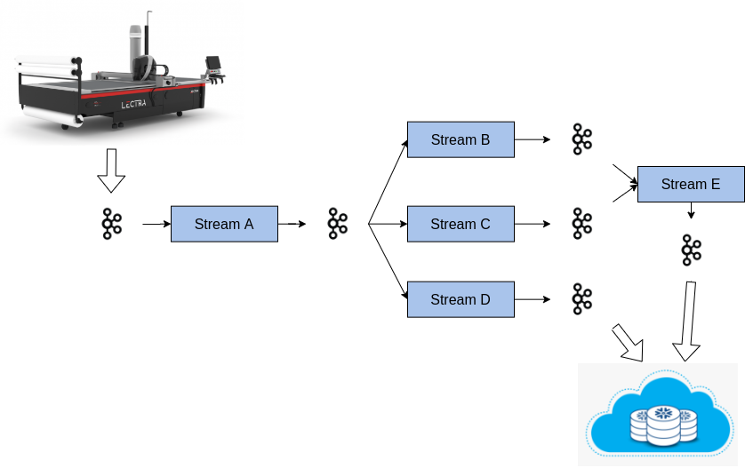
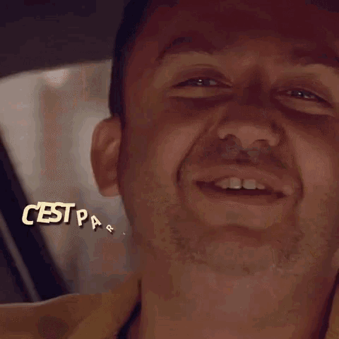

= 🕺Kapoeira💃
:source-highlighter: rouge
//:highlightjs-languages: bash, gherkin, javascript, json, scala
:icons: font

image::images/kapoeira.gif[]

// Tests d'intégration dans un environnement Kafka

// == Sommaire
// * Kapoeira
// * Syntaxe
// * Démo

== Presentation

image::images/kara.jpeg[width=300]

Mehdi Rebiai::
* icon:github[] https://github.com/mrebiai
* icon:envelope[] mehdi.rebiai.dev@gmail.com
* Techlead & Data engineer at https://www.lectra.com[Lectra^]

=== Presentation

image::images/odile.jpeg[width=400]

Johanna Vauchel::
* icon:github[] https://jvauchel.github.io/
* icon:envelope[] vauchel.johanna@gmail.com
* Data engineer at https://www.lectra.com[Lectra^] & speaker 🎤

== Opensource at Lectra

=== Lectra
image:images/lectra-4.0.png[width=800]

=== Opensource

[%step]
* Use Foss projects to build our solutions
** define a Foss policy to manage this usage
* Use Innersource projects
** incubator for futur Opensource projects
* Contributor and creator of Opensource projects
** Partner in the https://hermine-foss.org/ project
** Kapoeira ...

== Take Away 🎁

[%step]
* Discover a new tool to *test* your kafka streams
* Help you in your *communication* with PO/QA/DEV
* *Tips* to use it every day
* Have a good time (we hope)

== 📽️ Kapoeira story 🎬

=== Vector

image:images/vector.png[width=500]

=== Enrich and collect data

image:images/enrichData.png[width=800]

=== Data pipeline

=== We are perfect !

image:images/perfect.jpg[width=800]

=== Data is perfect !

image:images/pipeline-example.png[width=800]

=== NO !
image::images/no-not.gif[width=600]

=== NO !
image:images/pipeline-example-poo.png[width=800]

=== Solution ?

TESTS OUR STREAMS!

=== How to test ?

https://docs.confluent.io/platform/current/streams/developer-guide/test-streams.html[TopologyTestDriver^]

image:images/fast.jpg[width=500]

Fast and efficient...

=== Scala Test Example

[source, scala]
----
include::code/topology-driver.scala[]
----

=== Happy 😀...🤮

=== ... But it's a mocked infrastructure

image:images/fail.jpeg[width=600]

It did not test the *integration* with the Kafka cluster

=== ... And only unit tests

image:images/end-to-end.png[width=600]

How to test *several* streams ?

=== ... And it's not for QA (=👮)

image:images/les-nuls-police.gif[width=500]

=== ... And it's technical code

image:images/simon-kara.gif[width=600]

How to *communicate* with DEV/PO/QA ?

== What do we need ?

image:images/test-pyramid.png[width=350]
image:images/cesar-triangle.gif[width=400]

*Integration* tests with a *simple* syntax

[.columns]
=== Inspiration : Karate

[.column]
image:images/karate.png[width=200]

[.column]
* HTTP-based APIs
* Peter Thomas - 2017
* Simple syntax (https://cucumber.io/docs/gherkin/reference/[Gherkin^])
* https://youtu.be/Cnma3WbKvtE?si=TXYHGSpiib9SATIJ[Talk about Karate @BdxIO2018^]

=== Our context != HTTP
image::images/kafkalogo.jpg[width=300]

Integration with *Kafka Streams* !

== What is Kapoeira?

Cucumber Scala, using specific Gherkin DSL.

image::images/cucumber.png[width=200]

=== What is Gherkin ?

----
include::features/CucumberExample.feature[]
----

=== What is Cucumber ?

----
include::code/CucumberStepDef.scala[]
----

=== How does it work ?

image::images/archi.png[width=400]

=== How does it work ?

image::images/kapoeira-diagram.png[width=600]

=== 2020 - Birth of Kapoeira
image::images/young-chabat.jpg[width=300]

* Inner Source @Lectra
* First syntax created with a QA
* Backend calling Confluent CLI

=== CLI...
[source]
----
# Console producer
kafka-console-producer \
  --topic orders \
  --bootstrap-server broker:9092 \

# Console consumer
kafka-console-consumer \
  --topic orders \
  --bootstrap-server broker:9092 \
  --from-beginning
----

=== 2020 - Custom backend
* Specific Scala implementation for Kafka Consumer/Producer
* Better syntax with Gherkin Datatable

=== 2021 - ZIO

image:images/zio.jpeg[width=300]

To improve perfs and add parallel mode ?

=== 2023 - Open Source

image:images/kapoeira_logo_text.png[width=200]

icon:github[] https://github.com/lectra-tech/kapoeira

=== 2024 - New features
Thanks to you !

[.columns]
== Demo
[.column]
image::images/buger-quiz.gif[width=400]

[.column]
image::images/rapport.gif[width=500]

// Note

// Frite simple patate => une frite (v1 sans uuid)
// Fichier : plusieurs patates dans un fichier => une frite par patate

// Header : Mayo/ Ketchup en header => et en sortie header Mayo et Header

// internal function: on ajoute le uuid

// lot de records : burger mais à simplifier (side dishes à enlever

// call script ?$

// assertion : output = value/price ???

// feature à évoquer sans demo : avro/json schema, external script

// demo avec QA/PO/DEV, publique, on part d'une story, on écrit le test, il marche pas (report KO), on débloque le code qui fonctionne, le report est vert

=== Fries.feature
[source, gherkin]
----
include::features/fries.feature[]
----

=== An architecture
image::diagrams/burger-quiz.svg[width=800]

=== Docker commands
----
docker compose build --no-cache
docker compose up -d
docker restart kapoeira
----

=== burger.feature
[source, gherkin]
----
include::features/burger.feature[]
----

=== meal.feature
[source, gherkin]
----
include::features/meal.feature[]
----

== Advanced example

[source, gherkin]
----
include::features/example.feature[]
----

// explication feature, scenario, background, .....

=== Report

image::images/report.png[width=450]

== REX

[%step]
* 👐 Big community in Lectra
* ✏️ Easy for QA to enrich existing tests
* 🤝 Used as acceptance tests, specifications during story grooming
* 🔄 Used as end-to-end tests

[.columns]
=== Advantages

[.column]
image:images/advantages.gif[width=500]

[.column]
[%step]
* Kafka infra
* Simple to use
* Communicate with PO/QA/DEV
* tests as documentation
* tests as acceptance for stories

== Want to use it ?

=== How to build ?

----
docker build -t kapoeira:latest .
----

=== How to use ?

https://hub.docker.com/r/lectratech/kapoeira[Docker Hub image]

----
docker run --rm -ti \
-v <PATH_TO_YOUR_FEATURES_FOLDER>:/features \
-v /var/run/docker.sock:/var/run/docker.sock \
-e KAFKA_BOOTSTRAP_SERVER=<HOST:PORT[,HOST2:PORT2,HOST3:PORT3,...]> \
-e KAFKA_SCHEMA_REGISTRY_URL=<URL> \
-e KAFKA_USER=<XXX> \
-e KAFKA_PASSWORD=<****> \
-e JAAS_AUTHENT=<true (default) | false> \
-e LOGGING_LEVEL=<INFO (default) | ERROR | ...> \
-e THREADS=<8 (default) | ... > \
lectratech/kapoeira
----

=== How to contribute ?

TODO

// === Story Telling
// * C'est quoi
// ** outil TI Kafka
//
// * Pourquoi
// ** tests topo driver insuffisants, pas d'outil sur le marché, QA pas outillé
// ** on recherche un outil pour communiquer en DEV/QA/PO

// * Histoire
// ** Inspiration Karate (et Gherkin)
// ** Naissance en 2020 (1ere implem naive, basé sur console-script confluent)
// ** Utilisation de ZIO dès 202x (pour améloration perf)

// * Explication syntaxe
// ** Simple d'utilisation et utilisable par tous
//
// * Utilisation
//
// * Démo
//
// * REX Kapo dans notre quotidien
// ** Niveau d'adoption
// ** Utilisation dès spec pour test d'acceptance
// ** Facilité d'enrichissement de test apres les DEV
// ** Définition de tests End2End
//
// * Contribution

// === Tests d'intégration dans un environnement Kafka
// image::https://raw.githubusercontent.com/lectra-tech/kapoeira/main/docs/diagrams/kapoeira.png[]
//
// === Les origines...
// * Contexte Lectra
// * Inner Source puis OpenSource

// == Syntaxe
// TODO

== Thank you !

== Thanks for your feedback

image:images/WebinarQRCode.png[width=200]

icon:github[] https://jvauchel.github.io/

icon:github[] https://mrebiai.github.io/

icon:envelope[] vauchel.johanna@gmail.com

icon:envelope[] mehdi.rebiai.dev@gmail.com