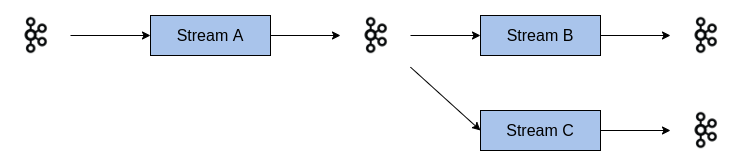
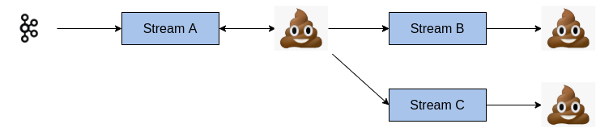
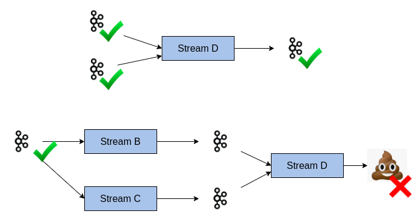

= 🕺Kapoeira💃
:source-highlighter: rouge
//:highlightjs-languages: bash, gherkin, javascript, json, scala
:icons: font

image::images/kapoeira.gif[]

// Tests d'intégration dans un environnement Kafka

// == Sommaire
// * Kapoeira
// * Syntaxe
// * Démo

== Presentation

image::images/kara.jpeg[width=300]

Mehdi Rebiai::
* icon:github[] https://github.com/mrebiai
* icon:envelope[] mehdi.rebiai.dev@gmail.com
* Techlead & Data engineer at https://www.lectra.com[Lectra]

== Presentation

image::images/odile.jpeg[width=400]

Johanna Vauchel::
* icon:github[] https://jvauchel.github.io/
* icon:envelope[] vauchel.johanna@gmail.com
* Data engineer at https://www.lectra.com[Lectra] & speaker 🎤

== Take Away 🎁

[%step]
* Discover a new tool to *test* your kafka streams
* Help you in your *communication* with PO/QA/DEV
* *Tips* to use it every day
* Have a good time (we hope)

== 🎬 Kapoeira story 📽️

=== Enrich and collect data

image:images/enrichData.png[width=800]

=== We are perfect !

image:images/perfect.jpg[width=800]

=== Data is perfect !

=== NO !

=== Solution ?

TESTS OUR STREAMS!

=== How to test ?

https://docs.confluent.io/platform/current/streams/developer-guide/test-streams.html[TopologyTestDriver]

image:images/fast.jpg[width=500]

Fast and efficient...

=== Scala Test Example

[source, scala]
----
package com.lectra.kafka.stream.example

import org.apache.kafka.common.serialization.{StringDeserializer, StringSerializer}
import org.apache.kafka.streams._
import org.scalatest.flatspec.AnyFlatSpec
import org.scalatest.matchers.should.Matchers
import org.scalatest.{BeforeAndAfterAll, BeforeAndAfterEach, GivenWhenThen}

import java.io.File
import java.util.UUID

class KafkaStreamSelectKeyTest extends AnyFlatSpec with Matchers with BeforeAndAfterEach with BeforeAndAfterAll with GivenWhenThen {

  private val stringSerializer = new StringSerializer()
  private val stringDeserializer = new StringDeserializer()

  private var driver: TopologyTestDriver = _
  private var inputTopic: TestInputTopic[String, String] = _
  private var outputTopic: TestOutputTopic[String, String] = _

  private def tempDir: File = {
    val ioDir = System.getProperty("java.io.tmpdir")
    val f = new File(ioDir, "kafka-" + UUID.randomUUID().toString)
    f.mkdirs()
    f.deleteOnExit()
    f
  }

  private def buildTopology(): Topology = {
    import org.apache.kafka.streams.scala.StreamsBuilder
    val builder = new StreamsBuilder
    KafkaStreamSelectKey.topology(builder)
    builder.build()
  }

  override def beforeEach(): Unit = {
    KafkaStreamAvro.config.put(StreamsConfig.STATE_DIR_CONFIG, tempDir.getAbsolutePath)
    driver = new TopologyTestDriver(buildTopology(), KafkaStreamSelectKey.config)
    inputTopic = driver.createInputTopic(KafkaStreamSelectKey.topicIn, stringSerializer, stringSerializer)
    outputTopic = driver.createOutputTopic(KafkaStreamSelectKey.topicChangedKey, stringDeserializer, stringDeserializer)
  }

  override def afterEach(): Unit = {
    driver.close()
  }

  "Nominal case for select" should "change the key of records by combining key and value with -" in {
    val key = "mykey"
    val value = "myvalue"
    val key2 = "yourkey"
    val value2 = "yourvalue"

    inputTopic.pipeInput(key, value)
    inputTopic.pipeInput(key2, value2)
    val expectedKey1 = s"$key-$value"
    val expectedKey2 = s"$key2-$value2"

    outputTopic.getQueueSize shouldBe 2
    outputTopic.readKeyValue() shouldBe new KeyValue(expectedKey1, value)
    outputTopic.readKeyValue() shouldBe new KeyValue(expectedKey2, value2)

  }

}
----

=== ... But it's mock

it did not test the *integration* with the Kafka cluster

=== ... But unitary

how to test *several* streams ?

=== ... But it's not for QA

image:images/les-nuls-police.gif[width=500]

Listen, let's *DEV* do their job !

=== ... But it's code

image:images/simon-kara.gif[width=600]

how to *communicate* with DEV/PO/QA ?

== What do we need ?

image:images/test-pyramid.png[width=350]

*Integration* tests with *simple* syntax

=== What do we need ?

image::images/kafkalogo.jpg[width=300]

Integration with *Kafka Streams*

[.columns]
=== Inspiration : Karate

[.column]
image:images/karate.png[width=200]

[.column]
* HTTP-based APIs
* Peter Thomas - 2017
* simple syntax (https://cucumber.io/docs/gherkin/reference/[Gherkin])

== 2020 - Birth of Kapoeira

* Inner Source
* Uses command lines developed by Confluent

[source, bash]
----
# Console producer
kafka-console-producer \
  --topic orders \
  --bootstrap-server broker:9092 \

# Console consumer
kafka-console-consumer \
  --topic orders \
  --bootstrap-server broker:9092 \
  --from-beginning \
----

=== 2021 - ZIO

image:images/zio.jpeg[width=300]

To improve perfs and add parallel mode ?

=== 2023 - Open Source

image:images/kapoeira_logo_text.png[width=200]

icon:github[] https://github.com/lectra-tech/kapoeira

=== 2024 - New features

Thanks to you !

== Inside Kapoeira

Cucumber Scala, using specific Gherkin DSL.

image::images/cucumber.png[width=200]

=== How does it work ?

image::images/archi.png[width=400]

=== How does it work ?

image::images/kapoeira-diagram.png[width=600]

=== Example

[source, gherkin]
----
include::features/example.feature[]
----

// explication feature, scenario, background, .....

=== Report

image::images/report.png[width=450]

== Démo
image::images/buger-quiz.gif[]

=== Architecture
image::diagrams/burger-quiz.svg[width=800]

=== Docker commands
----
docker compose build --no-cache
docker compose up -d
docker restart kapoeira
----

=== burger.feature
[source, gherkin]
----
include::features/burger.feature[]
----

=== meal.feature
[source, gherkin]
----
include::features/meal.feature[]
----

=== REX

[%step]
* 👐 Big community in Lectra
* ✏️ Easy for QA to enrich existing tests
* 🤝 Used as acceptance tests, specifications during story grooming
* 🔄 Used as end-to-end tests

[.columns]
=== Advantages

[.column]
image:images/advantages.gif[width=500]

[.column]
[%step]
* Kafka infra
* Simple to use
* Communicate with PO/QA/DEV
* tests as documentation
* tests as acceptance for stories

== Want to use it ?

image::images/banco.gif[width=500]

=== How to build ?

----
docker build -t kapoeira:latest .
----

=== How to use ?

https://hub.docker.com/r/lectratech/kapoeira[Docker Hub image]

----
docker run --rm -ti \
-v <PATH_TO_YOUR_FEATURES_FOLDER>:/features \
-v /var/run/docker.sock:/var/run/docker.sock \
-e KAFKA_BOOTSTRAP_SERVER=<HOST:PORT[,HOST2:PORT2,HOST3:PORT3,...]> \
-e KAFKA_SCHEMA_REGISTRY_URL=<URL> \
-e KAFKA_USER=<XXX> \
-e KAFKA_PASSWORD=<****> \
-e JAAS_AUTHENT=<true (default) | false> \
-e LOGGING_LEVEL=<INFO (default) | ERROR | ...> \
-e THREADS=<8 (default) | ... > \
lectratech/kapoeira
----

=== How to contribute ?

TODO

// === Story Telling
// * C'est quoi
// ** outil TI Kafka
//
// * Pourquoi
// ** tests topo driver insuffisants, pas d'outil sur le marché, QA pas outillé
// ** on recherche un outil pour communiquer en DEV/QA/PO

// * Histoire
// ** Inspiration Karate (et Gherkin)
// ** Naissance en 2020 (1ere implem naive, basé sur console-script confluent)
// ** Utilisation de ZIO dès 202x (pour améloration perf)

// * Explication syntaxe
// ** Simple d'utilisation et utilisable par tous
//
// * Utilisation
//
// * Démo
//
// * REX Kapo dans notre quotidien
// ** Niveau d'adoption
// ** Utilisation dès spec pour test d'acceptance
// ** Facilité d'enrichissement de test apres les DEV
// ** Définition de tests End2End
//
// * Contribution

// === Tests d'intégration dans un environnement Kafka
// image::https://raw.githubusercontent.com/lectra-tech/kapoeira/main/docs/diagrams/kapoeira.png[]
//
// === Les origines...
// * Contexte Lectra
// * Inner Source puis OpenSource

// == Syntaxe
// TODO

